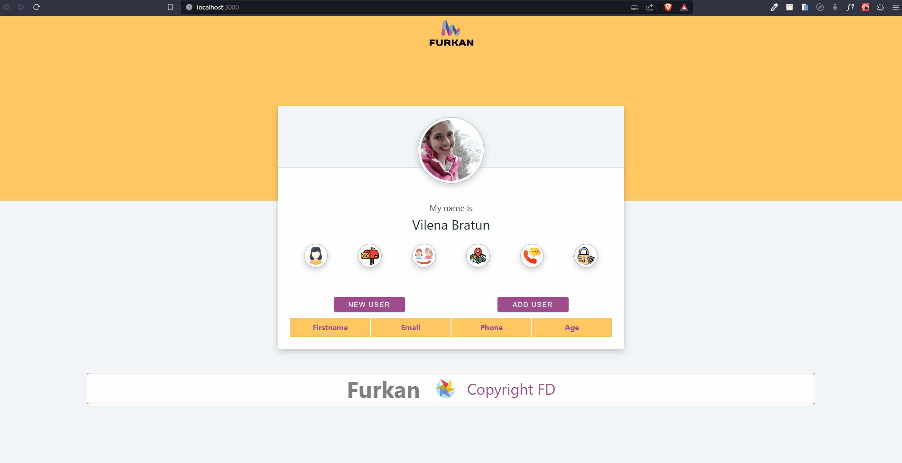
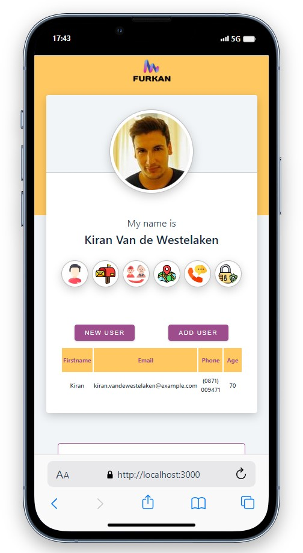
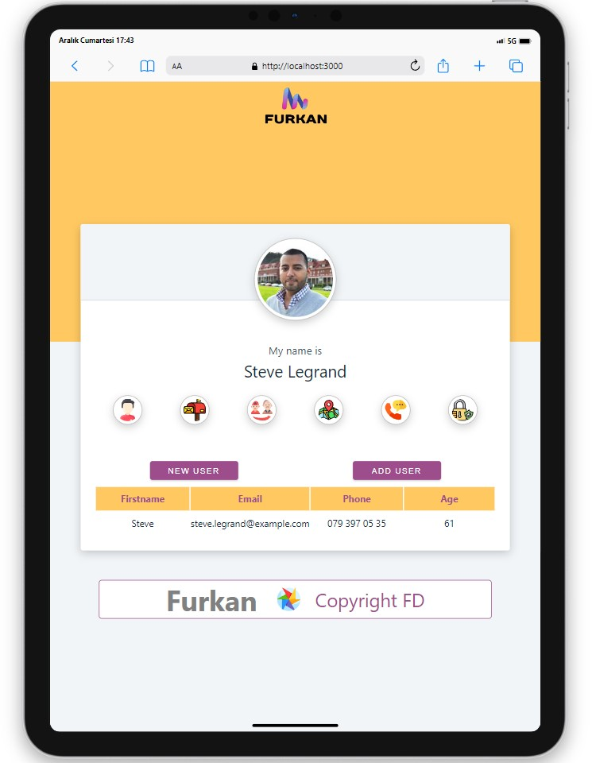
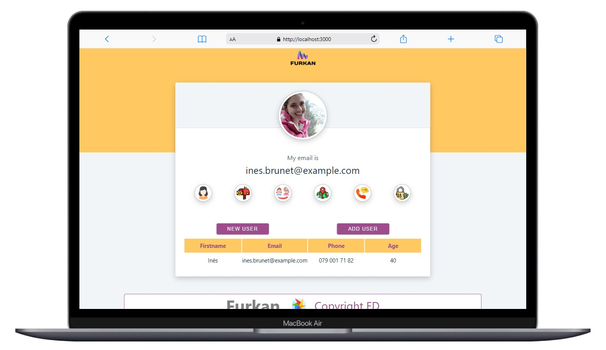

# Random User App

<div align="center">
  
</div>

## About the Project

This React project is a web application that displays random user data by utilizing data retrieved from an API.

## Table of Contents

- [Features](#features)
- [Dependencies](#dependencies)
- [Project Skeleton](#project-skeleton)
- [Screenshots](#screenshots)

## Live Demo

[Random User App](https://random-user-app-virid.vercel.app/)

## Features

- Fetches and displays random user data.
- Allows navigation between different users.
- Includes basic information, contact details, and images of users.

## Dependencies

- Bootstrap
- Axios
- Sweetalert2

## Project Skeleton

```
Random User App
|
|----readme.md         
SOLUTION
├── public
│     └── index.html
├── src
│    ├── assets
│    │       └── [images]
│    ├── components
│    │       └── footer
│    │             ├── Footer.css 
│    │             └── Footer.jsx 
│    ├── App.js
│    ├── App.css
│    └── index.js
├── package.json
└── yarn.lock
```

## Screenshots

<div align="center">
  
  
  
</div>

## Compatibility

The project is compatible with both wide-screen computers and mobile devices.
